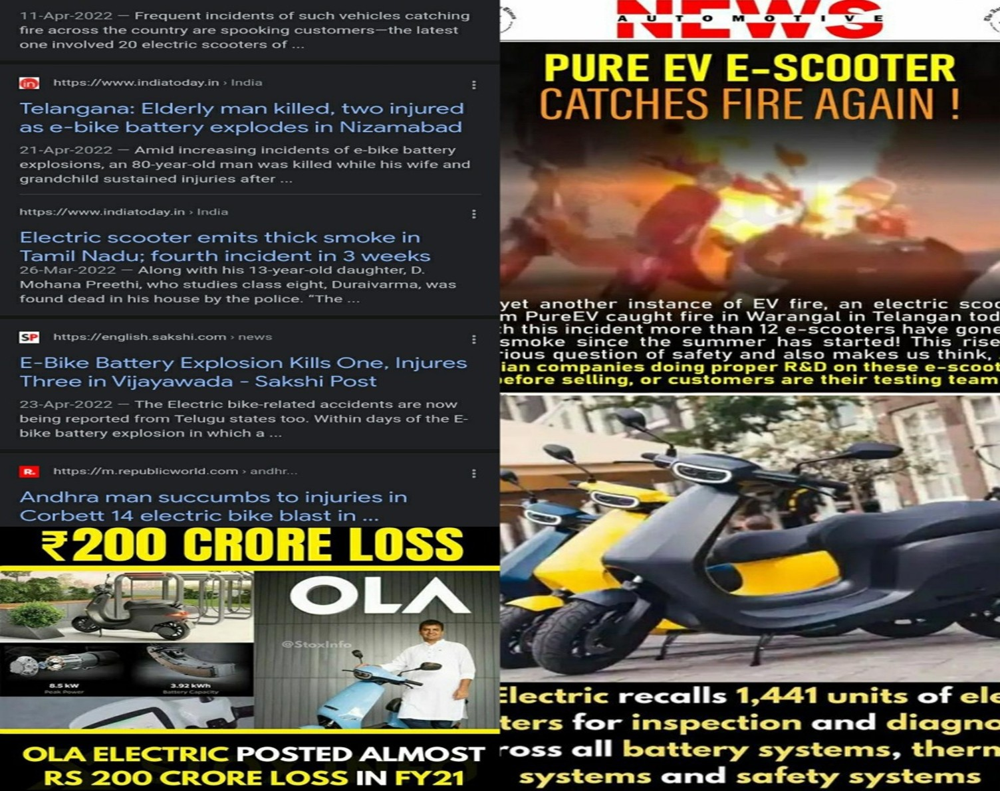

# 🚲 Case Study: Public Perception of E-Bikes (2022)

## 📌 Project Overview
In **May 2022**, e-bikes were at the center of public discussion in India.  
A surge of accident reports was making headlines, creating **fear and skepticism** among potential users.  

To capture public sentiment at that moment, I conducted a **primary survey-based research project** as part of my MBA program.  
This project is not about today’s trends but serves as a **time capsule of perceptions in 2022**.  
## 📰 News Headlines (2022)
The study was motivated by heavy media coverage of e-bike accidents:

---

## 🛠 What I Did
- Designed a structured **questionnaire**  
- Collected **130 responses** from employees across different companies  
- Performed **data cleaning & analysis** in Excel and Python  
- Applied a **Chi-Square Test** to test the relationship between *occupation* and *willingness to adopt e-bikes*  
- Visualized the results with charts for awareness, intention, and impressions  
- Documented the full findings in a research paper  

---

## 📊 Key Insights (2022)
- **94%** of respondents were aware of e-bikes  
- **76%** were aware of accidents involving e-bikes  
- Only **14%** expressed intention to use them in the future → strong reluctance  
- **58%** reported a **negative impression** after hearing accident news  
- Chi-Square Test showed that **occupation influenced willingness to adopt**  

⚡ These findings highlight how **safety perceptions directly impacted adoption decisions** at that time.  

---

## 📂 Files in this Repository
- `e-bike-analysis.ipynb` → Jupyter/Colab notebook with charts & chi-square test  
 - `README.md` → Project documentation  

Here are sample pages from the survey:

  
  
  
  
  
---

## 🎯 Skills Demonstrated
- **Survey Design & Data Collection** (questionnaire-based)  
- **Data Analysis** (descriptive statistics, chi-square test)  
- **Data Visualization** (pie charts, bar charts, cross-tab analysis)  
- **Research Report Writing** (structured insights & conclusion)  

---

## ⚠️ Disclaimer
- This study was conducted in **May 2022** as part of an **academic research project**.  
- The dataset and findings reflect perceptions during that period and **may not represent current trends**.  
- The analysis, charts, and interpretations are **original work by me**. Please do not reproduce without permission.  

---

## ✅ Outcome
This project demonstrates how I can:  
- Translate a **real-world issue** into a **structured research study**  
- Use **statistical tools** to validate hypotheses  
- Present findings in a way that **supports decision-making**  

Even though trends may have shifted since 2022, this work showcases my **research & analytical abilities** in handling live, time-sensitive issues.

